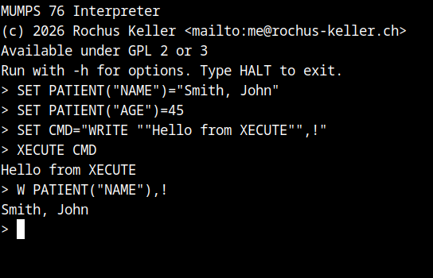

The goal of this project is to build a faithful implementation of the 1976 MUMPS standard (see the [NBS Handbook 118](https://archive.org/details/bitsavers_mumpsNBSHaageStandardJan1976_6795659), the first formal specification of the MUMPS language), including a MUMPS 76 parser, interpreter, and 
the integrated hierarchical database that anticipated NoSQL by four decades.

The year 2026 marks the **50th anniversary** of this standard, and also the **60th anniversary** of MUMPS (and myself), and is therefore a good time for this project.

This is the most recent one in a series of projects where I explore legacy programming languages of significance; other notable mentions are [Simula](https://github.com/rochus-keller/Simula), [Smalltalk](https://github.com/rochus-keller/Smalltalk), [Cedar](https://github.com/rochus-keller/Cedar), [Interlisp](https://github.com/rochus-keller/Interlisp), and [Lisa Pascal](https://github.com/rochus-keller/LisaPascal).

I first came into contact with MUMPS in my early twenties when, during a refresher course, the military doctor enthusiastically demonstrated his own medical information system written in this special language after learning that I was studying at ETH. Since then, I have returned to MUMPS time and again, gained practical experience with Intersystems Caché, and even implemented MUMPS’s hierarchical data model in my own databases (see [Sdb](https://github.com/rochus-keller/Sdb) and [Udb](https://github.com/rochus-keller/Udb)).

Every existing MUMPS implementation targets a later, much larger standard (e.g. GT.M, YottaDB and RSM target the 1995 ANSI standard, partly with extensions, and have more than twice as many commands and functions). As it seems, nobody so far has implemented *just the 1976 standard*. By implementing the minimal, original standard using modern languages and tools, we can:

- Study the architecture as it was designed; the 1976 standard represents the consensus of the MUMPS community about what the language *essentially is*, stripped of vendor extensions and features that weren't yet proven.

- Run historical software from the era; as can be seen in the testcases directory, still much source code from the period is available; I'm particularly interested in the DECUS archives, but running the COSTAR (Computer-Stored Ambulatory Record, developed at MGH in the 1970s) and DHCP (which later became VistA) would also be great.

- Demonstrate what made MUMPS significant: a 19-command language with an integrated hierarchical database, running historical hospital software on a PDP-11, anticipating NoSQL by four decades.


## What is MUMPS

MUMPS (Massachusetts General Hospital Utility Multi-Programming System), is an imperative, high-level programming language with a tightly integrated key–value database. Its defining characteristic is that language and database are not separate concerns: persistent, hierarchical sparse arrays (called globals) are a first-class part of the language itself, accessible by simply prefixing variable names with a caret (^). The language has a single universal data type (implicitly coerced to string, integer, or float), supports dynamic arrays stored as B-trees in sorted canonical order, and allows nearly all commands to be abbreviated to one or two characters (a remnant of its resource-constrained origins).

MUMPS was created in 1966 by Neil Pappalardo, Robert A. Greenes, and Curt Marble in Dr. Octo Barnett's lab at Massachusetts General Hospital (MGH) in Boston, originally running on a donated DEC PDP-7. It emerged from a NIH-funded hospital information systems project and was designed from the outset for multi-user operation, portability across hardware platforms, and efficient manipulation of the text-like, hierarchical data common in medicine. Because it was developed under a government research grant, it was released into the public domain and quickly spread through the medical community, leading to a proliferation of implementations across PDP-8, PDP-11, VAX, and other architectures. By the mid-1970s, barely a decade after its creation, the majority of U.S. hospitals were running MUMPS-based systems for patient records and clinical data management. The language was standardized in the 1976 NBS (National Bureau of Standards) Handbook 118, followed by ANSI X11.1-1977 and subsequently revised through ANSI X11.1-1995 and ISO 11756:1999, which was re-affirmed by ISO in 2020.

MUMPS, even today, remains in active production use, predominantly in healthcare and finance. In the U.S. healthcare sector, MUMPS-based systems still serve over 78% of patients. The U.S. Department of Veterans Affairs (VA)'s VistA system alone runs across more than 1'500 VA sites, including 172 medical centers, serving over 9 million veterans.

**[Read my MUMPS 76 Primer here](https://github.com/rochus-keller/MUMPS/blob/main/docs/MUMPS_Primer.adoc)** ([PDF for download](docs/MUMPS_Primer.pdf))

## Why is MUMPS interesting

MUMPS was born from a simple but radical insight: hospitals needed a system where doctors and nurses could simultaneously access and update patient data from multiple terminals, in real time, on affordable hardware. In 1966, "affordable hardware" meant a DEC PDP-7 with 8K words of 18-bit memory and a small disk. What emerged was something that the database world wouldn't have a name for until four decades later: a NoSQL database with an integrated programming language. MUMPS globals, the core data abstraction, are hierarchical sparse arrays stored persistently on disk and shared among all concurrent users. In modern terms:

```
SET ^PATIENT(12345,"NAME")="Smith, John"
SET ^PATIENT(12345,"DOB")="1945-03-15"
SET ^PATIENT(12345,"LAB","2024-01-15","GLUCOSE")=95
```

This is a hierarchical key-value store with composite keys and natural lexicographic ordering. The `^` sigil means "persistent"; this data lives on disk, and is visible to every user on the system. There is no CREATE TABLE, no schema definition, no INSERT statement. 

Consider what MUMPS had in the late sixties that the rest of the database world would spend the next fifty years reinventing:

- Schema-free storage: No declarations required. Nodes are created on first assignment, deleted on demand. The tree structure is fully dynamic. This is what MongoDB would call "schemaless documents" in 2009.
- Hierarchical data model: Patient records naturally form trees; a patient has labs, each lab has results, each result has values. MUMPS globals mirror this structure directly. This is what Firebase would call "real-time hierarchical data" in 2012.
- Ordered key traversal: The `$NEXT` function (later `$ORDER`) walks through sibling nodes in sorted order, without requiring an explicit index. This is what Redis would call "sorted sets" in 2009, or what LevelDB would call "ordered iteration" in 2011.
- Atomic multi-user access: Multiple users can read and write the same globals concurrently. The LOCK command provides application-level concurrency control. This is what modern databases call "optimistic concurrency."
- Integrated language + database: There is no impedance mismatch between the programming language and the data store. Variables and database nodes use the same syntax, the same data types, the same operations. This is what some modern systems aspire to but none have achieved as cleanly.

All of this ran on a machine with 8 kilobytes of memory, serving many simultaneous users in real-time.

The conventional history of databases runs: hierarchical (IMS, 1966) -> network (CODASYL, 1969) -> relational (Codd, 1970) -> SQL (System R, 1974) -> object-oriented (1980s) -> NoSQL (2000s). MUMPS doesn't appear in this history because it was created by hospital programmers, not computer science researchers, and it was published in medical informatics journals, not ACM proceedings. Yet MUMPS globals anticipated the NoSQL movement by four decades; and unlike the NoSQL systems that arrived in the 2000s, MUMPS combined the database with a complete programming language and a multi-user operating system, all in a fraction of the memory that a single MongoDB process consumes today.

SQL won the database wars of the 1980s and 1990s, only for the industry to discover in the 2000s that hierarchical key-value stores were better suited to many real-world workloads. When Amazon published the Dynamo paper in 2007, when Google released Bigtable, when MongoDB launched in 2009, they were (unknowingly) validating design decisions that Barnett, Pappalardo, and Marble had made in a Boston hospital in 1966. Now, on the 50th anniversary of the first standard and 60th anniversary of MUMPS, is a good opportunity to look back what they already had, and maybe to learn something for the future.

## How does MUMPS look

The %DOC routine from the DSM-11 source code, compressed, single-space indent, as it would appear on a VT100 terminal:
```mumps
DOC ;GEF;DSM UTILITIES;OCTAL - DECIMAL CONVERTER
 S $ZT="%ERR^%DOC"
%A R !,"Enter number >   ",%X G %Q1:%X="?" I %X=""!(%X="^") K %X,%ZE Q
 I %X?1N.N S %DO=%X D %DO I $D(%DO) W "     #",%DO K %DO G %A
 I %X'?1"#"1N.N D %IV G %A
 S %OD=$E(%X,2,999) D %OD I '$D(%OD) D %IV G %A
 W "     ",%OD K %OD G %A
%DO ;
 I %DO'?1N.N K %DO Q
 S %A="",%Y=%DO
 F %I=1:1 S %A=%Y#8_%A,%Y=%Y\8 Q:'%Y
 I %Y S %A=%Y_%A
 S %DO=%A
 K %A,%Y,%X,%I Q
%OD ;
 I %OD["8"!(%OD["9") K %OD Q
 S %M=1,%S=""
 F %I=$L(%OD):-1:1 S %S=%S+(%M*$E(%OD,%I)),%M=%M*8
 S %OD=%S K %I,%M,%S Q
%Q1 W !!,?5,"Enter   ^ or <CR> To quit"
 W !,?8,"or   A decimal integer"
 W !,?8,"or   #  followed by an octal integer"
 W !,?8,"or   ?  for this message",! G %A
%IV W !,?5,"Incorrect response - Enter '?' for more information" Q
%ERR I $ZE?1"<MXNUM>".E W "  Too large" G %DOC
 W !,$ZE Q
```

The same %DOC routine, but with full command names, meaningful variables, structured with comments:
```mumps
%DOC  ; Octal-Decimal Converter (GEF, DSM-11 Utilities, ca. 1978)
      SET $ZTRAP = "%ERR^%DOC"              ; on error jump to %ERR

%A    READ !,"Enter number >   ",input      ; prompt user
      GOTO %Q1 : input="?"                  ; show help
      IF input="" ! (input="^")  KILL input  QUIT

      ; Decimal to octal
      IF input ? 1N.N  SET result=input  DO %DO  DO
      .  IF $DATA(result)  WRITE "     #",result
      .  KILL result  GOTO %A

      ; Validate "#" prefix
      IF input '? 1"#"1N.N  DO %IV  GOTO %A

      ; Octal to decimal (strip "#")
      SET result = $EXTRACT(input,2,999)  DO %OD
      IF '$DATA(result)  DO %IV  GOTO %A
      WRITE "     ",result  KILL result  GOTO %A

      ; --- Decimal to Octal: divide by 8, prepend remainders ---
%DO   IF result '? 1N.N  KILL result  QUIT
      SET accum="",value=result
      FOR i=1:1 SET accum=value#8_accum,value=value\8 QUIT:'value
      IF value  SET accum = value _ accum
      SET result = accum
      KILL accum,value,i  QUIT

      ; --- Octal to Decimal: sum digits * powers of 8 ---
%OD   IF result["8" ! (result["9")  KILL result  QUIT
      SET mult=1,sum=""
      FOR i=$LENGTH(result):-1:1  DO
      .  SET sum = sum + (mult * $EXTRACT(result,i))
      .  SET mult = mult * 8
      SET result=sum  KILL i,mult,sum  QUIT

%Q1   WRITE !!,?5,"Enter   ^ or <CR> to quit"
      WRITE !,?8,"or   a decimal integer"
      WRITE !,?8,"or   #  followed by an octal integer"
      WRITE !,?8,"or   ?  for this message",!  GOTO %A
%IV   WRITE !,?5,"Incorrect response - Enter '?' for more information"  QUIT
%ERR  IF $ZERROR ? 1"<MXNUM>".E  WRITE "  Too large"  GOTO %DOC
      WRITE !,$ZERROR  QUIT
```

## How can I try it

This project includes a complete, single-user MUMPS 76 parser, interpreter (with batch and REPL mode) and database which you can 
download and run (see "Precompiled versions" below). After starting it and entering commands, you see something like this:



The REPL supports cursor navigation and a command history. You can e.g. copy/paste the commands from the many
[MUMPS Primer examples](https://github.com/rochus-keller/MUMPS/blob/main/docs/MUMPS_Primer.adoc), or try to run original
MUMPS applications from the seventies and  eighties which you can find in the testcases directory. There is e.g. the
original STARTREK application in testcases/corpus/decus/startrek which you can run with `mumps STARTREK.rou`; here
is a [screenshot of the running application](docs/imgs/mumps76_runnin_startrek.png).

Because the original standard is so compact, the entire system is implemented in 
under 10,000 lines (SLOC) of C++, making it an easily approachable codebase for study.


## Development Log

### Status on June 18, 2026

The lexer and parser now work pretty well and pass > 90% of the test cases (excluding the truncation issues).
The EBNF grammar covers all 19 standard commands + Z-commands + DSM-11 extensions, but there are still ambiguities.
The LL(1) parser was generated using [EbnfStudio](https://github.com/rochus-keller/EbnfStudio).
The lexer now handles MUMPS's unusual whitespace semantics (including CmdSep emission, paren-depth tracking, extended global refs, 
and bracket skipping) pretty well, which was difficult to get right. It's likely the most complex lexer in my collection.
The next stage is the interpreter and some form of intermediate representation. There are also issues with long-line handling
and indirection (@) to be solved, and I need better error recovery.

### Status on June 22, 2026

The interpreter works with dedicated tests and PCT_DOC.mps; globals are implemented, though there is no database yet.
All 19 commands are implemented; OPEN, CLOSE, USE, LOCK, VIEW, JOB, ZCMD are only stubs so far. Also the intrinsic
functions $T and $V are stubs, but $L, $E, $P, $A, $C, $D, $O, $S, $F, $J, $G, $TR, and $R are implemented.
The parser is callable at runtime; cross-routine calls and XECUTE are implemented.
The goal of the interpreter is functionality, completeness and comprehensibility, not performance. 

### Status on June 25, 2026

There is now an interactive interpreter mode. You can either run a MUMPS routine file or enter the interpreter. 
I also made progress with a [MUMPS Primer](docs/MUMPS_Primer.adoc) (see docs subdirectory) which specifically
describes the 1976 version with a lot of practical examples. The original documents from 1976 are a bit hard to
read and use uncommon terminology for today's programmers. There is now also a BUSY build and a precompiled version
for Linux. Also the global store is making good progress.

### Status on June 27, 2026

The global store works and is integrated with the interpreter. It has less code than I had expected (< 1000 SLOC), so 
the whole project is below 10 kSLOC of C++). The CLI/REPL now has a more robust implementation and supports multi-command
pasting and a command history. The Primer is complete and the examples have been tested on the interpreter.
To my surprise, the interpreter seems to be able to run a large part of the corpus and dsm11 code (my guesstimate is > 70%,
some day I should analyze this more precisely). MVP release.

## Precompiled versions

The following binaries are available at this time:

- [Linux x86_64](https://software.rochus-keller.ch/mumps76_linux_x64.tar.gz)
- [Windows x86](https://software.rochus-keller.ch/mumps76_windows_x86.zip)
- [macOS arm64](https://software.rochus-keller.ch/mumps76_macOS_arm64.zip)

NOTE: macOS becomes more patronizing with every release, so you might not be able to simply start the executable;
    if so, try `xattr -dr com.apple.quarantine /path/to/mumps`; if that doesn't work, you can try
   `codesign --force --deep --sign - /path/to/mumps`; or just use the Windows binary and run it with Wine.

## Build Steps

Follow these steps if you want to build the application yourself. The same code builds on Linux, macOS and Windows 
(and likely a lot of other operating systems and architectures):

1. Make sure a Qt 5.x (libraries and headers) version compatible with your C++ compiler is installed on your system.
1. Download the source code from https://github.com/rochus-keller/mumps/archive/master.zip and unpack it.
1. Goto the unpacked directory and execute `QTDIR/bin/qmake MpsParserTest.pro` (see the Qt documentation concerning QTDIR).
1. Run make; after a couple of seconds you will find the executable in the build directory.

Alternatively you can open the *.pro files using QtCreator and build everything there.

Alternatively you can use [BUSY](https://github.com/rochus-keller/BUSY) or [LeanCreator](https://github.com/rochus-keller/LeanCreator) using the
provide BUSY file together with [LeanQt](https://github.com/rochus-keller/LeanQt). Just download 
[the LeanQt archive](https://github.com/rochus-keller/LeanQt/archive/refs/heads/main.zip) and unpack it into the same root directory where the MUMPS archive
was unpacked, and make sure its name is "LeanQt". See the [BUSY Users Guide](https://github.com/rochus-keller/BUSY/blob/main/docs/The_BUSY_Build_System_Users_Guide.adoc) for
more information on how to proceed with BUSY. If you have LeanCreator installed, just open the BUSY file an activate the "Build All" menu.

## Support
If you need support or would like to post issues or feature requests please use the Github issue list at https://github.com/rochus-keller/mumps/issues or send an email to the author.


 

